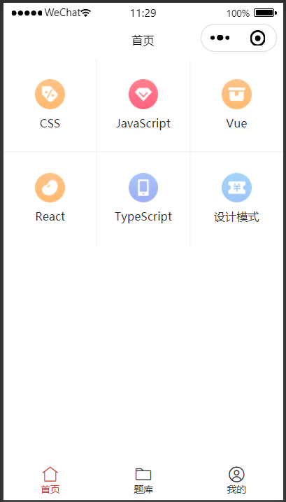
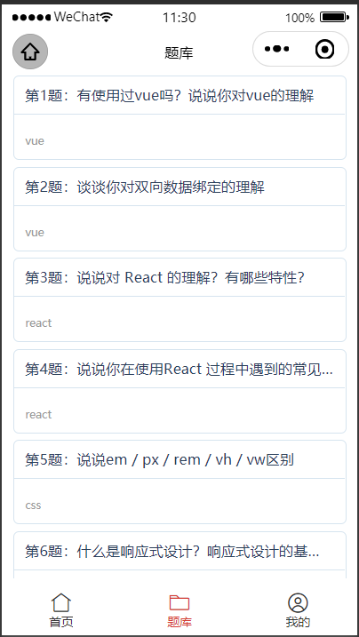
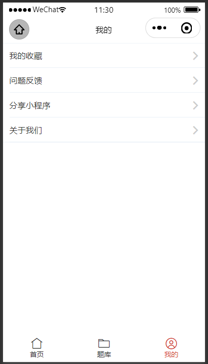
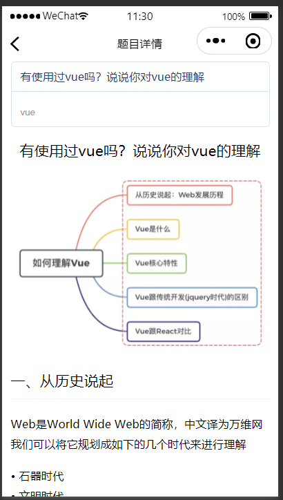

##  相关文档

[Taro介绍](https://taro-docs.jd.com/taro/docs/)

Taro 是一个开放式跨端跨框架解决方案，支持使用 React/Vue/Nerv 等框架来开发 微信 / 京东 / 百度 / 支付宝 / 字节跳动 / QQ / 飞书 小程序 / H5 / RN 等应用。

[React](https://react.docschina.org/)

[TypeScript](https://www.tslang.cn/docs/home.html)

[Taro-UI](https://taro-ui.jd.com/#/docs/introduction)

注意：
Taro 3 只能配合使用 taro-ui@next 版本
安装命令： `npm i taro-ui@next`

##  开发目的

- 实现一个前端面试刷题的小程序，可以刷题库进行知识点回顾以及查缺补漏，抽题考察进行知识点掌握训练；
- 熟悉下微信小程序的开发、部署、发布等流程
- 熟悉下技术栈`typescript+react-hooks+taro+taro-ui`

##  环境准备

[tarojs的安装及使用](https://taro-docs.jd.com/taro/docs/GETTING-STARTED)

  Taro 项目基于 node，请确保已具备较新的 node 环境（>=12.0.0）

### CLI 工具安装

```sh
# 使用 npm 安装 CLI
$ npm install -g @tarojs/cli

# OR 使用 yarn 安装 CLI
$ yarn global add @tarojs/cli

# OR 安装了 cnpm，使用 cnpm 安装 CLI
$ cnpm install -g @tarojs/cli
```

> 值得一提的是，如果安装过程出现sass相关的安装错误，请在安装 mirror-config-china 后重试。

```sh
$ npm install -g mirror-config-china
```

### 项目初始化

```sh
taro init myApp
```

npm 5.2+ 也可在不全局安装的情况下使用 npx 创建模板项目：

```sh
$ npx @tarojs/cli init myApp
```

按自己的喜好选择对应的开发工具即可，比如使用react还是vue/vue3，是否使用TS，使用sass还是less等等；

一般来说，依赖安装会比较顺利，但某些情况下可能会安装失败，这时候你可以在项目目录下自己使用安装命令进行安装：

```sh
# 进入项目根目录
$ cd myApp

# 使用 yarn 安装依赖
$ yarn

# OR 使用 cnpm 安装依赖
$ cnpm install

# OR 使用 npm 安装依赖
$ npm install
```

### 编译运行

以微信小程序为例

```sh
# yarn
$ yarn dev:weapp
$ yarn build:weapp

# npm script
$ npm run dev:weapp
$ npm run build:weapp
```

####  小程序开发者工具

下载并打开[微信开发者工具](https://developers.weixin.qq.com/miniprogram/dev/devtools/download.html)，然后选择项目根目录进行预览。

需要注意开发者工具的项目设置：

- 需要设置关闭 ES6 转 ES5 功能，开启可能报错
- 需要设置关闭上传代码时样式自动补全，开启可能报错
- 需要设置关闭代码压缩上传，开启可能报错

以上步骤全部完成，可在小程序开发者工具里面预览到一个hello  world的界面；

### 小程序主流程简介

参考了目前线上的一些前端面试题小程序，预计程序大概的流程如下：

- 有三个底部tab：首页、题库、我的
- 首页会有banner和题型分类区块（CSS、js、vue、react、ts、设计模式等等）
- 题库就包含所有题型分类的总数据列表
- 题目详情页：题目列表各项可点击至跳转至题目详情页
- 我的页面会包含用户的基本信息展示，分享小程序、关于我们等一些介绍内容

####  小程序部分图示







####  代码结构

```
// 主要代码结构
src
    -components
      --SubjectItem // 题目展示组件
      --TabBar // 底部tab组件
    -pages
      --index // 首页
      --my // 我的
      --subject // 题库
      --subjectDetail // 课程详情页
      --subjectList // 课程列表页
app.config.ts // pages信息配置
```

##  开发流程

UI库选择taro-ui，Taro 3 只能配合使用 taro-ui@next 版本
安装命令： `npm i taro-ui@next`

### 首页

- 使用taro-ui的AtGrid完成分类组件块的UI
- 点击分类项跳转（Taro.navigateTo）题目列表页面
- 封装底部tabBar组件，题库和我的页签会用到

```js
// src/pages/index/index.ts
import { FC } from 'react'
import { View } from '@tarojs/components'
import { AtGrid } from "taro-ui"
import Taro from '@tarojs/taro';
import TabBar from '../../components/TabBar/index';
import './index.scss'
import { classifyList } from './data/classifyList';

type GridItemData = {
  image: string;
  value: string;
  tag?: string;
};

const gridClick = (item: GridItemData, index: number) => { 
  Taro.navigateTo({
    url: `/pages/subjectList/index?tag=${item.tag}`
  });
}

const Index: FC = (props) => { 
  return (
    <View className='index'>
      <AtGrid
        data={classifyList}
        onClick={gridClick}
      />
      <TabBar current={0} />
    </View>
  )
}

export default Index;

// src/app.config.ts
pages: [
  'pages/index/index', // 首页
  ...
],
```

#### 题目列表
